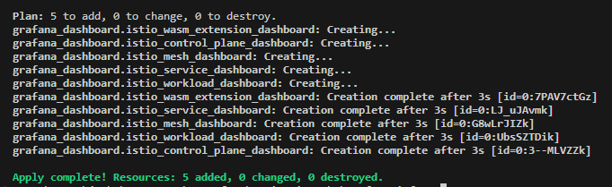
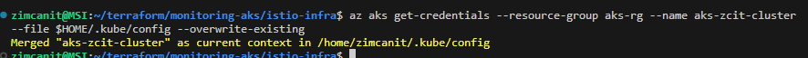
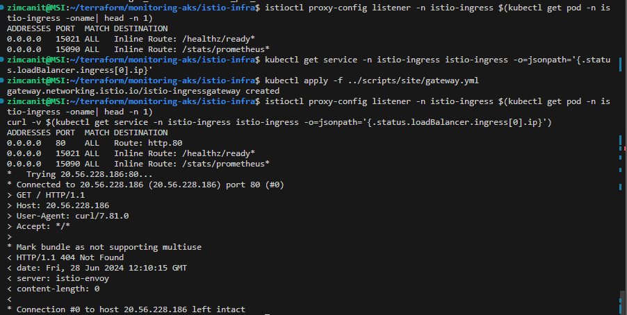
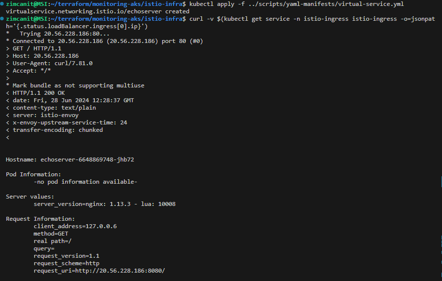
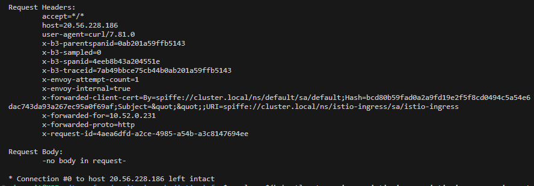
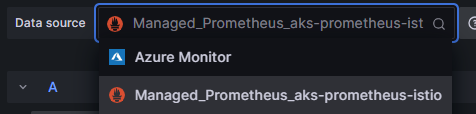
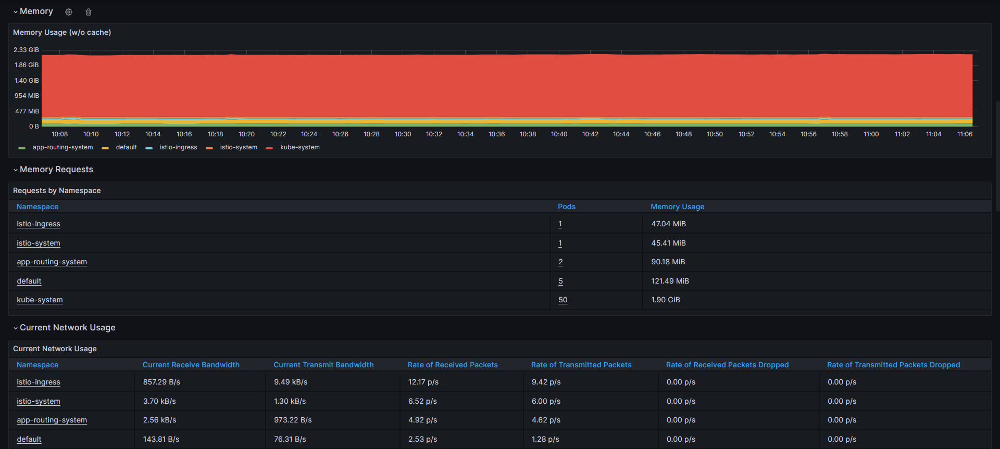

# Monitoring Azure Kubernetes Service with Prometheus and Grafana 

## Aim
Deploy Azure Managed Grafana and Azure Monitor workspace for Prometheus observability of an AKS cluster.

## Integrate the ISTIO service mesh and deploy within Kubernetes:
- mTLS PeerAuthentication
- Traffic authorization policies
- Health probes and gateways

## Assumption
Deploying in a Linux Debian environment.

## Deployment 

### Pre-requisites
1. **[Install Docker Desktop on Windows](https://docs.docker.com/desktop/install/windows-install/)**
2. **Download [jq](https://jqlang.github.io/jq/download/)**
   - Alternative download with chocolatey (requires admin mode PowerShell terminal): `choco install jq`
3. **[Install Windows Subsystem for Linux](https://learn.microsoft.com/en-us/windows/wsl/install)**
4. **Download kubectl utility:**
   - [Windows](https://kubernetes.io/docs/tasks/tools/install-kubectl-windows/)
   - [Linux](https://kubernetes.io/docs/tasks/tools/install-kubectl-linux/)
5. **Install [Azure CLI](https://learn.microsoft.com/en-us/cli/azure/install-azure-cli)**
6. **Authenticate to Azure:**
   - `az login --tenant <insert tenant ID>`
   - `az account set --subscription "<subscription_id_or_subscription_name>"`
   - `az account show`
7. **Ensure pre-requisites bash script is executable:** `chmod 755 pre-reqs.sh`
   - Deploy pre-requisites: `bash scripts/pre-reqs.sh`

### Deploy AKS cluster, Prometheus, and Azure Managed Grafana and setup kubeconfig file
1. **Navigate to `aks-infra` directory**
2. **Deploy terraform config:**
   - `terraform init`
   - `terraform validate`
   - `terraform plan`
   - `terraform apply --auto-approve`
3. **Set Grafana environment variables from terraform outputs:**
   - `grafana_name`
   - `grafana_url`
   - `grafana_token`
4. **Create kubeconfig file:** `terraform output kube_config > $HOME/.kube/config`
   - Delete `<<EOF` and `EOF` lines at the beginning and end of the YAML file
   - Set kubeconfig credentials file as environment variable: `export KUBECONFIG="$HOME/.kube/config"`

### Deploy Grafana ISTIO dashboards
1. **Navigate to `grafana-infra` directory**
2. **Run terraform commands:**
   - `terraform init`
   - `terraform validate`
   - `terraform plan`
   - `terraform apply --auto-approve`



### Deploy ISTIO infrastructure
1. **Navigate to `istio-infra` directory**
2. **Run terraform commands:**
   - `terraform init`
   - `terraform validate`
   - `terraform plan`
   - `terraform apply --auto-approve`
3. **Set the current kubeconfig context to the deployed AKS cluster:**
   - `az aks get-credentials --resource-group aks-rg --name aks-zcit-cluster --file $HOME/.kube/config --overwrite-existing`



4. **Enable pods in the default namespace to be injected with the sidecar container:**
   - `kubectl label namespace default istio-injection=enabled`
5. **Deploy echoserver workload in the default namespace:**
   - `kubectl apply -f ../scripts/yaml-manifests/echoserver.yml`
6. **Deploy site:**
   - `kubectl apply -f ../scripts/yaml-manifests/aks-gift-store.yml`
7. **View deployed site pod:** `kubectl get pods`
8. **Retrieve public IP "EXTERNAL-IP" address of the store:**
   - `kubectl get service store-front --watch`
   - Use `CTRL+C` to stop the kubectl watch process
9. **View the deployed webpage in the browser using the public IP copied from the above-mentioned command**

### Configure a gateway
1. **Remain in the directory `istio-infra`**
2. **View empty envoy configuration due to gateway resource not being created:**
   - `istioctl proxy-config listener -n istio-ingress $(kubectl get pod -n istio-ingress -o name | head -n 1)`
3. **Get gateway service IP, which is exposed with Kubernetes service type [LoadBalancer]:**
   - `kubectl get service -n istio-ingress istio-ingress -o=jsonpath='{.status.loadBalancer.ingress[0].ip}'`
4. **Configure gateway resource:**
   - `kubectl apply -f ../scripts/yaml-manifests/gateway.yml`
5. **View gateway resource listening on port 80:**
```
istioctl proxy-config listener -n istio-ingress $(kubectl get pod -n istio-ingress -o name | head -n 1)
curl -v $(kubectl get service -n istio-ingress istio-ingress -o=jsonpath='{.status.loadBalancer.ingress[0].ip}')
```
   - **Expected output HTTP 404 due to envoy not knowing which service to route the request**



### Confgure a virtual service and echoserver health probe
1. **Route requests to echoserver ClusertIp in default namespace via a virtualService**
   - `kubectl apply -f ../scripts/yaml-manifests/virtual-service.yml`
2. **Query reaching echoserver pod:**
   - `curl -v $(kubectl get service -n istio-ingress istio-ingress -o=jsonpath='{.status.loadBalancer.ingress[0].ip}')`
3. **Create virtual service for echoserver health probe on port 15021:**
   - `kubectl apply -f ../scripts/yaml-manifests/echoserver-15021-health-probe.yml`





### Configure mTLS PeerAuthenciations, destination rules and verify traffic is encrypted
1. **You can enforce the crd `peerauthentications.security.istio.io` by [enforcing mTLS](https://istio.io/latest/docs/reference/config/security/peer_authentication/)**
   - `kubectl apply -f ../scripts/yaml-manifests/mtls-auth.yml`
2. **peerAuthentication enforces mTLS at the receiver of the TLS connection. The client requires a [destination rule](https://istio.io/latest/docs/reference/config/networking/destination-rule/)**
   - `kubectl apply -f ../scripts/yaml-manifests/mtls-dest-rules.yml`

### Observability
1. **Access Azure managed grafana resoruce in Azure Portal and access the grafana server endpoint**
2. **Dashboards installed by terraform will be listed, but won't present data**
  * https://grafana.com/grafana/dashboards/7645-istio-control-plane-dashboard/
  * https://grafana.com/grafana/dashboards/7639-istio-mesh-dashboard/
  * https://grafana.com/grafana/dashboards/7636-istio-service-dashboard/
  * https://grafana.com/grafana/dashboards/7630-istio-workload-dashboard/
  * https://grafana.com/grafana/dashboards/13277-istio-wasm-extension-dashboard/
3. **Scraping of metrics isn't happening over mTLS and envoy sidecars are refusing scraping connection attempts**
4. **Resolve by configuring peerAuth to DISABLE on the scraping port 15020:**
   - kubectl apply -f ../scripts/yaml-manifests/mtls-allow-scraping.yml`

### Authorisation policies
1. **Deploy an authorisation policy in the istio-ingress namespace. Allowing only reqests to istio ingressGateway, if the request is to the [nip.io](https://nip.io/) domain.**
   - `kubectl apply -f ../scripts/yaml-manifests/istio-ingress-auth-policy.yml`
2. **Test the policy:**
   - **Will result in an HTTP 403 error:**
     -  `curl -v $(kubectl get service -n istio-ingress istio-ingress -o=jsonpath='{.status.loadBalancer.ingress[0].ip}')/`
   - **Will result in an HTTO 404 successful code:**
     - `curl -v $(kubectl get service -n istio-ingress istio-ingress -o=jsonpath='{.status.loadBalancer.ingress[0].ip}').nip.io/`


### Configuring the grafana dashabord
1. **NOTE: the data source used for the dashboards is set in the PLACEHOLDER variable in the pre-reqs.sh script, which removes the default datasource reference ${DS_PROMETHEUS}**
2. **Launch Grafana instacne by accessing the server URL in the Azure Portal**
   - **Navigate to: `Home > Connections > Prometheus Data Source > Explore > Define a query > Run query`**
   - **View copmute resource usage off the Kubernetes cluster by navigating to: `Home > dashboards > Azure Managed Prometheus > Kubernetes/Copmute Resources/Cluster`**






### Clean-up infrastructure
1. **Destroy infrastructre in each subdirectory: grafana-infra, istio-infra and aks-infra**
   - `terraform destroy --auto-approve`

## Documentation 

### AKS-INFRA
1. [Azure Managed Prometheus and Grafana for AKS monitoring](https://www.youtube.com/watch?v=sGWtz_kkKX8)
2. [Quickstart: Deploy an Azure Kubernetes Service (AKS) cluster using Terraform](https://learn.microsoft.com/en-us/azure/aks/learn/quick-kubernetes-deploy-terraform?tabs=bash&pivots=development-environment-azure-cli)
3. [Install and Set Up kubectl on Windows](https://kubernetes.io/docs/tasks/tools/install-kubectl-windows/)
4. [Automating Managed Prometheus and Grafana with Terraform](https://medium.com/microsoftazure/automating-managed-prometheus-and-grafana-with-terraform-for-scalable-observability-on-azure-4e5c5409a6b1)
5. [Azure Monitor managed service for Prometheus](https://learn.microsoft.com/en-us/azure/azure-monitor/essentials/prometheus-metrics-overview)
6. [Guide monitoring repo for this deployment](https://github.com/zioproto/istio-aks-example/tree/main/istio-on-aks-with-managed-prometheus-grafana)
7. [Terraform kubernetes cluster deployment examples](https://github.com/hashicorp/terraform-provider-azurerm/tree/main/examples/kubernetes)
8. [Understand Azure Policy for Kubernetes clusters](https://learn.microsoft.com/en-ie/azure/governance/policy/concepts/policy-for-kubernetes)
9. [Use the Azure Key Vault provider for Secrets Store CSI Driver in an Azure Kubernetes Service (AKS) cluster](https://learn.microsoft.com/en-us/azure/aks/csi-secrets-store-driver)
10. [Use the cluster autoscaler in Azure Kubernetes Service (AKS)](https://learn.microsoft.com/en-us/azure/aks/cluster-autoscaler?tabs=azure-cli)


### GRAFANA-INFRA
1. [Tutorial: Call Grafana APIs programmatically](https://learn.microsoft.com/en-gb/azure/managed-grafana/how-to-api-calls?tabs=azure-cli)
2. [Istio Control Plane Dashboard](https://grafana.com/grafana/dashboards/7645-istio-control-plane-dashboard/)
3. [Istio Mesh Dashboard](https://grafana.com/grafana/dashboards/7639-istio-mesh-dashboard/)
4. [Istio Service Dashboard](https://grafana.com/grafana/dashboards/7636-istio-service-dashboard/)
5. [Istio Workload Dashboard](https://grafana.com/grafana/dashboards/7630-istio-workload-dashboard/)
6. [Istio Wasm Extension Dashboard](https://grafana.com/grafana/dashboards/13277-istio-wasm-extension-dashboard/)

### ISTIO-INFRA 
1. [Istio getting started](https://istio.io/latest/docs/setup/getting-started/) 
2. [Introducing istiod: simplifying the control plane](https://istio.io/latest/blog/2020/istiod/)
3. [Istio Setup in Kubernetes | Step by Step Guide to install Istio Service Mesh](https://www.youtube.com/watch?v=voAyroDb6xk&t=1353s)
4. [Terraform helm resource provider](https://registry.terraform.io/providers/hashicorp/helm/latest/docs/resources/release)
5. [Download istio](https://istio.io/latest/docs/setup/getting-started/#download)
6. [istio prometheus integrations](https://istio.io/latest/docs/ops/integrations/prometheus/#tls-settings)
7. [Istio gateway](https://istio.io/latest/docs/reference/config/networking/gateway/)